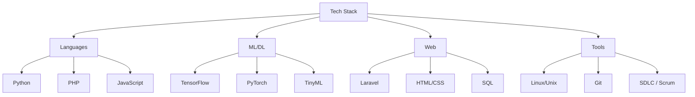

  <h1><code>&gt;_ Zain Ahmed</code></h1>
  <h3>Building scalable intelligence systems.</h3>

  

    
    
  

   

  

    BSc in Computer Science & Engineering graduate. Focused on developing production-grade AI/ML solutions. Specializing in scalable ML systems, deep learning architectures, and TinyML IoT applications.
  

 
 

<h3><code>// CURRENT_FOCUS</code></h3>

<ul>
  <li>Developing production-ready <b>ML pipelines</b> (Scalability & Performance)</li>
  <li>Researching <b>Neural Architecture Search</b> (NAS) techniques</li>
  <li>Implementing <b>MLOps</b> strategies for automated deployment</li>
  <li>Contributing to open-source Deep Learning libraries</li>
</ul>

 

<h3><code>// TECH_STACK</code></h3>

 

<h3><code>// GITHUB_METRICS</code></h3>

  
  
   
  

 

<h3><code>// FEATURED_PROJECTS</code></h3>

<table>
  <thead>
    <tr>
      <th align="left" width="200">Project</th>
      <th align="left" width="150">Stack</th>
      <th align="left">Description</th>
    </tr>
  </thead>
  <tbody>
    <tr>
      <td><b>Neural Architecture Search</b></td>
      <td>
        
        
        
      </td>
      <td>
        Automated architecture discovery reducing search time by 60% while maintaining SOTA accuracy.
          
        <b>Key Features:</b> Multi-objective optimization, Hardware-aware search, Distributed training.
      </td>
    </tr>
    <tr>
      <td><b>MLOps Pipeline</b></td>
      <td>
        
        
        
      </td>
      <td>
        End-to-end production pipeline with automated versioning, real-time monitoring, and scalable inference.
          
        <b>Key Features:</b> Automated model versioning, Real-time monitoring, Scalable inference.
      </td>
    </tr>
    <tr>
      <td><b>TinyML Emotion Detection</b></td>
      <td>
        
        
        
      </td>
      <td>
        Optimized voice signal processing for wearable devices using resource-efficient quantization techniques.
          
        <b>Key Features:</b> Voice signal processing, Resource-efficient ML models, Real-time detection.
      </td>
    </tr>
  </tbody>
</table>

 

<h3><code>// CONTACT</code></h3>

  Always open to collaborating on innovative AI/ML projects.
   
  <a href="https://www.linkedin.com/in/zain-ahmed-590795228/"><b>[Connect on LinkedIn]</b></a>

  <i>"The future belongs to those who can untangle complexity."</i>

