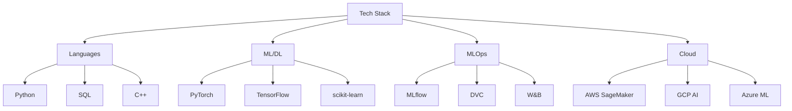

# $ whoami
### Crafting intelligence, one neural network at a time 🧠

## 🚀 AI/ML Engineer | Building the Future of Intelligence

> Transforming complex data into intelligent solutions. Currently focusing on scalable ML systems and exploring the frontiers of deep learning architectures.

### 🔭 Current Focus

- Developing production-ready machine learning pipelines with emphasis on scalability and performance
- Exploring advanced neural architecture search techniques for optimized model designs
- Implementing efficient model deployment strategies using modern MLOps practices
- Contributing to open-source ML projects to advance the field of AI

### 🛠️ Tech Arsenal

### 📊 GitHub Metrics

### 🔥 Featured Projects

<table>
  <tr>
    <td align="center">
      <b>🧠 Neural Architecture Search Framework</b> 
      Automated architecture discovery with 60% reduced search time 
      PyTorch • CUDA • Ray
    </td>
    <td align="center">
      <b>🎯 MLOps Pipeline</b> 
      End-to-end ML deployment with A/B testing 
      Kubernetes • MLflow • Docker
    </td>
    <td align="center">
      <b>🔍 Feature Selection Engine</b> 
      Hybrid statistical-neural feature importance scoring 
      scikit-learn • TensorFlow
    </td>
  </tr>
</table>

### 📫 Let's Connect!

I'm always open to collaborating on innovative AI/ML projects or discussing the latest developments in the field. Feel free to reach out!

---

  <i>"The future belongs to those who can untangle complexity and forge intelligence from chaos."</i>

