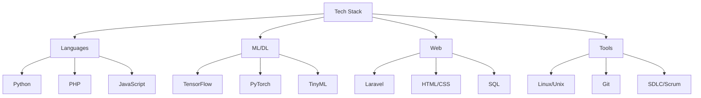

  <h1>
    <samp>$ whoami</samp>
  </h1>
  <h3>
    <samp>Crafting intelligence, one neural network at a time 🧠</samp>
  </h3>

  
  

  <h2>
    <samp>🚀 AI/ML Engineer | Building the Future of Intelligence</samp>
  </h2>

  

    BSc in Computer Science & Engineering graduate, focused on developing innovative AI/ML solutions with expertise in TinyML and IoT applications. Currently working on scalable ML systems and exploring the frontiers of deep learning architectures, with a particular interest in emotion detection and real-time processing systems.
  

<h3>
  <samp>🔭 Current Focus</samp>
</h3>

  • Developing production-ready machine learning pipelines with emphasis on scalability and performance 
  • Exploring advanced neural architecture search techniques for optimized model designs 
  • Implementing efficient model deployment strategies using modern MLOps practices 
  • Contributing to open-source ML projects to advance the field of AI

<h3>
  <samp>🛠️ Tech Arsenal</samp>
</h3>

<h3>
  <samp>📊 GitHub Metrics</samp>
</h3>

  

<h3>
  <samp>🔥 Featured Projects</samp>
</h3>

<table>
  <tr>
    <td align="center">
      <h4><samp>🧠 Neural Architecture Search Framework</samp></h4>
      
      
      
      
Automated architecture discovery with 60% reduced search time while maintaining state-of-the-art accuracy

      

        
Key Features

        

        • Multi-objective optimization 
        • Hardware-aware search 
        • Distributed training support
        

      

    </td>
    <td align="center">
      <h4><samp>🎯 MLOps Pipeline</samp></h4>
      
      
      
      
Production-grade ML deployment pipeline with automated A/B testing capabilities

      

        
Key Features

        

        • Automated model versioning 
        • Real-time monitoring 
        • Scalable inference
        

      

    </td>
    <td align="center">
      <h4><samp>🎭 TinyML Emotion Detection</samp></h4>
      
      
      
      
Research on optimizing emotion detection algorithms for IoT wearable devices using TinyML approaches

      

        
Key Features

        

        • Voice signal processing 
        • Resource-efficient ML models 
        • Real-time emotion detection
        

      

    </td>
  </tr>
</table>

<h3>
  <samp>📫 Let's Connect!</samp>
</h3>

  I'm always open to collaborating on innovative AI/ML projects or discussing the latest developments in the field. Feel free to reach out!

---

  

    <i>"The future belongs to those who can untangle complexity and forge intelligence from chaos."</i>
  

