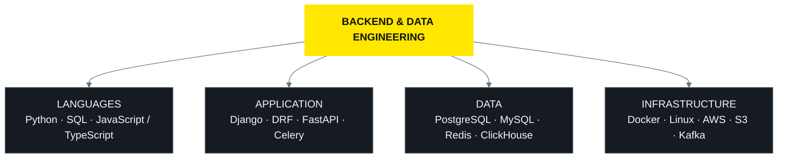

  <h1><code style="color:#FFE700;">&gt;_ Zain Ahmed</code></h1>
  <h3 style="color:#FFE700;">Building reliable backend systems.</h3>

  

    <a href="https://www.linkedin.com/in/zain-ahmed-590795228/">
      
      <b>LinkedIn</b>
    </a>
  

   

  

    Backend-focused software engineer working with Python, Django and data-intensive services. I build REST APIs, asynchronous processing pipelines and production systems on AWS, with practical experience across AI-assisted assessment and health-tech products.
  

 
 

<h3 style="color:#FFE700;"><code>// CURRENT_FOCUS</code></h3>

<ul style="color:#FFFFFF;">
  <li>Designing reliable <b>backend services and REST APIs</b></li>
  <li>Building <b>asynchronous workflows</b> with Celery, Redis and message queues</li>
  <li>Improving <b>database performance, observability and failure recovery</b></li>
  <li>Applying AI where it solves a concrete product or data problem</li>
</ul>

 

<h3 style="color:#FFE700;"><code>// TECH_STACK</code></h3>

```mermaid
flowchart TB
    A["BACKEND & DATA ENGINEERING"]:::core

    A --> B["LANGUAGES<br/>Python · SQL · JavaScript / TypeScript"]:::card
    A --> C["APPLICATION<br/>Django · DRF · FastAPI · Celery"]:::card
    A --> D["DATA<br/>PostgreSQL · MySQL · Redis · ClickHouse"]:::card
    A --> E["INFRASTRUCTURE<br/>Docker · Linux · AWS · S3 · Kafka"]:::card

    classDef core fill:#FFE700,stroke:#FFE700,stroke-width:2px,color:#111111,font-weight:bold;
    classDef card fill:#161B22,stroke:#4B5563,stroke-width:1px,color:#F3F4F6;
    linkStyle default stroke:#6B7280,stroke-width:1px;
```

 

<h3 style="color:#FFE700;"><code>// FEATURED_PROJECTS</code></h3>

<table style="color:#FFFFFF;">
  <thead>
    <tr>
      <th align="left" width="180">Project</th>
      <th align="left" width="190">Stack</th>
      <th align="left">Description</th>
    </tr>
  </thead>
  <tbody>
    <tr>
      <td><b><a href="https://github.com/X-eyn/DiZpatch">DiZpatch</a></b></td>
      <td>
        
        
        
      </td>
      <td>
        Field-service marketplace built as four cooperating services for work orders, provider matching, assignments and notifications.
          
        <b>Engineering:</b> Transactional outbox, idempotent consumers, database-per-service boundaries and infrastructure-backed integration tests.
      </td>
    </tr>
    <tr>
      <td><b><a href="https://github.com/X-eyn/Trek-back">Trek-back</a></b></td>
      <td>
        
        
         
        
        
      </td>
      <td>
        Production incident intelligence that ingests logs, groups related failures, detects error-rate anomalies and reconstructs failed traces.
          
        <b>Engineering:</b> Modular-monolith architecture, analytical and transactional storage, background workers and testable in-memory fallbacks.
      </td>
    </tr>
    <tr>
      <td><b><a href="https://github.com/X-eyn/SoraVault">SoraVault</a></b></td>
      <td>
        
        
      </td>
      <td>
        Bulk export and backup tool for OpenAI Sora media, liked content and original prompts.
          
        <b>Engineering:</b> Resumable exports, structured metadata preservation and a local-first approach to user archives.
      </td>
    </tr>
  </tbody>
</table>

 

<h3 style="color:#FFE700;"><code>// MORE_WORK</code></h3>

  <a href="https://github.com/X-eyn/Flox"><b>Flox</b></a> · Live video Picture-in-Picture with multi-source subtitle preservation
   
  <a href="https://github.com/X-eyn/FRag"><b>FRag</b></a> · Financial-document RAG with FastAPI, LangChain and vector search
   
  <a href="https://github.com/X-eyn/Credit-Risk-Scoring"><b>Credit Risk Scoring</b></a> · End-to-end data preparation, modeling and evaluation pipeline

 

<h3 style="color:#FFE700;"><code>// CONTACT</code></h3>

  Open to backend engineering, data-intensive systems and applied AI opportunities.
   
  <a href="https://www.linkedin.com/in/zain-ahmed-590795228/"><b>Connect on LinkedIn</b></a>

  <i>"I push to PROD on Thursdays (0_0)"</i>

